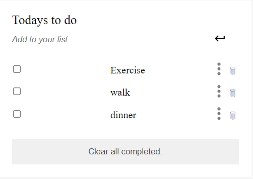

  
   

<!-- TABLE OF CONTENTS -->

# 📗 Table of Contents

- [📖 About the Project](#about-project)
  - [🛠 Built With](#built-with)
    - [Tech Stack](#tech-stack)
    - [Key Features](#key-features)
- [💻 Getting Started](#getting-started)
  - [Setup](#setup)
  - [Prerequisites](#prerequisites)
- [👥 Authors](#authors)
- [🔭 Future Features](#future-features)
- [🤝 Contributing](#contributing)
- [🙏 Acknowledgements](#acknowledgements)
- [📝 License](#license)

<!-- PROJECT DESCRIPTION -->

# 📖 TO-DO-LIST 

**TO-DO-LIST** 
- It simply lists the things that you need to do and allows you to mark them as complete, and it uses ES6 and Webpack.
- Single page website.
- configure with linters.

## 🛠 Built With 

### Tech Stack 

- HTML
- CSS
- JavaScript

<!-- Features -->

### Key Features 

- **UI is made of medium-fidelity wireframe**
- **Persistent data storage in local storage**

(<a href="#readme-top">back to top</a>)

<!-- GETTING STARTED -->

## 💻 Getting Started 

To get a local copy up and running, follow these steps.

### Prerequisites

No prerequisites required

### Setup

- Clone this repository to your desired folder
- Copy the path of the [Index.html](index.html) file
- Paste the path to your browser

(<a href="#readme-top">back to top</a>)

<!-- AUTHORS -->

## 👥 Authors 

👤 **Reem Mohamed**

- GitHub: [@githubhandle](https://github.com/ReemMohamedAbdelfatah)
- LinkedIn: [LinkedIn](https://www.linkedin.com/in/reem-abd-el-fatah-a07543116)

(<a href="#readme-top">back to top</a>)

<!-- FUTURE FEATURES -->

## 🔭 Future Features 

- **Convert UI to high fidelity**
- **Add animations**

(<a href="#readme-top">back to top</a>)

<!-- CONTRIBUTING -->

## 🤝 Contributing 

Contributions, issues, and feature requests are welcome!

Feel free to check the [issues page](https://github.com/ReemMohamedAbdelfatah/AwsomeBooksApp/issues).

(<a href="#readme-top">back to top</a>)

<!-- ACKNOWLEDGEMENTS -->

## 🙠Acknowledgments 

I would like to thank Microverse for the inspiration

(<a href="#readme-top">back to top</a>)

<!-- LICENSE -->

## 📝 License 

This project is [MIT](./LICENSE) licensed.

(<a href="#readme-top">back to top</a>)

# TO-DO-LIST

> Description the project.
- It simply lists the things that you need to do and allows you to mark them as complete, and it uses ES6 and Webpack.
- Single page website.
- configure with linters.

## Screenshot

# Live Demo

[Live Demo Link](https://reemmohamedabdelfatah.github.io/TO-DO-LIST/dist/)

# Built With
Major languages: HTML-CSS-JS
Frameworks: NodeJS, Webpack, Es6 Modules
Technologies used: VSCode, GitHub, Linter

## Getting Started
To get a local copy, follow these simple steps.

### Prerequisites
Web browser installed
VSCode to be installed.
GitHub account.
Even Git Bash or VSCode Source of Control to clone it in your local machine.

### Setup
Cloning a repository
* on Github.com, navigate to the main page of the repository;
* Above the list of files, click "Code" button; 
* Copy the URL to clone the repository.
* Open Terminal;
* Change the current working directory to the location where you want the cloned directory; 
* Type git clone, and then paste the URL you copied earlier; 
* Install Linters(linters.yml; .hintrc; .stylelintrc.json) - that linters configuration for Web, HTML and CSS

# Install

node.js
npm
linter configuration

# Usage

Browser
VSCode
GitHub

# Run tests

- follow this link :
 [HTML, CSS and Javascript Linters link]( https://github.com/microverseinc/linters-config/tree/master/html-css-js)

linters.yml for all of linters. (See below)
Styelint for auto-correct CSS errors or fixing the CSS style.
WebHint for cross-browser compatibility, speed, and to improve your Web's accessibility.
Eslint for correct javascript files.

## Authors

👤 **Reem Muhammed**

- GitHub: [@github](https://github.com/ReemMohamedAbdelfatah)
- LinkedIn: [LinkedIn](https://www.linkedin.com/in/reem-abd-el-fatah-a07543116)

## Acknowledgments

- Hat tip to anyone whose code was used
- Inspiration
- etc

## 🤝 Contributing

Contributions, issues, and feature requests are welcome!

Feel free to check the [issues page](../../issues/).

## Show your support

Give a ⭐️ if you like this project!

## 📝 License

This project is [MIT](./LICENSE) licensed.